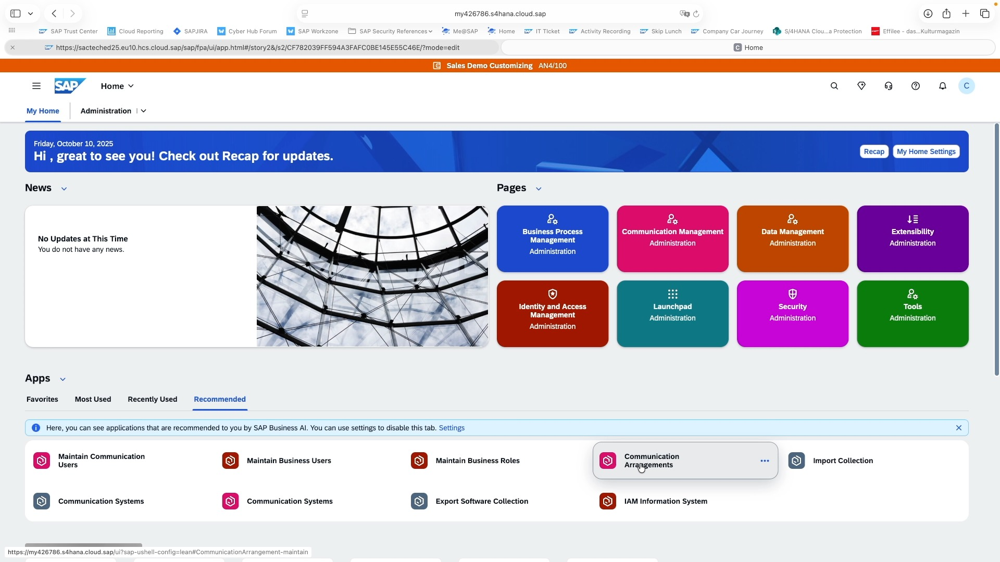
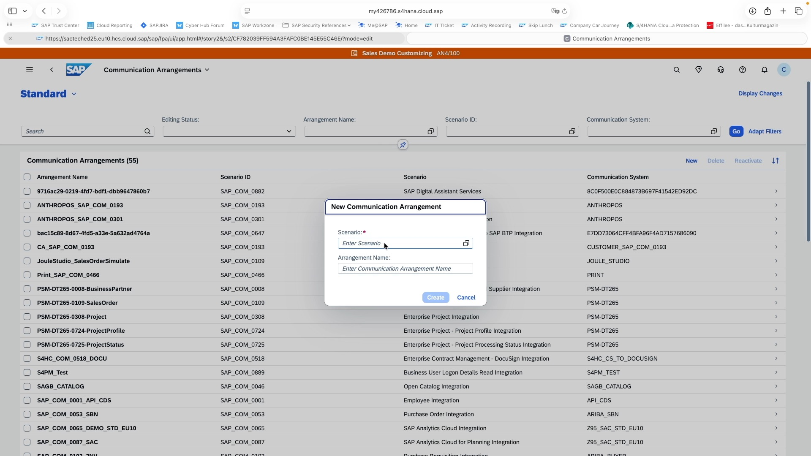
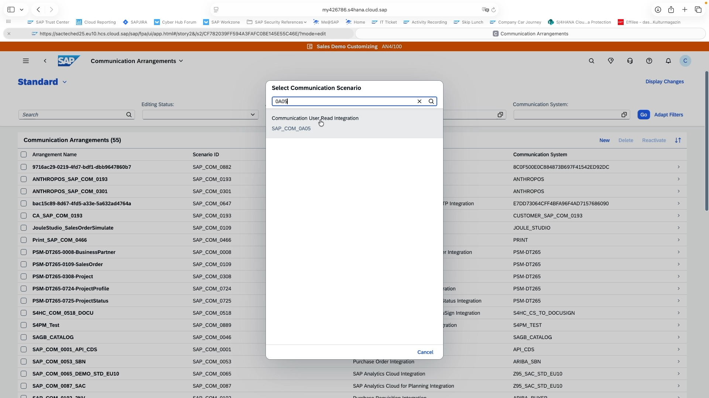
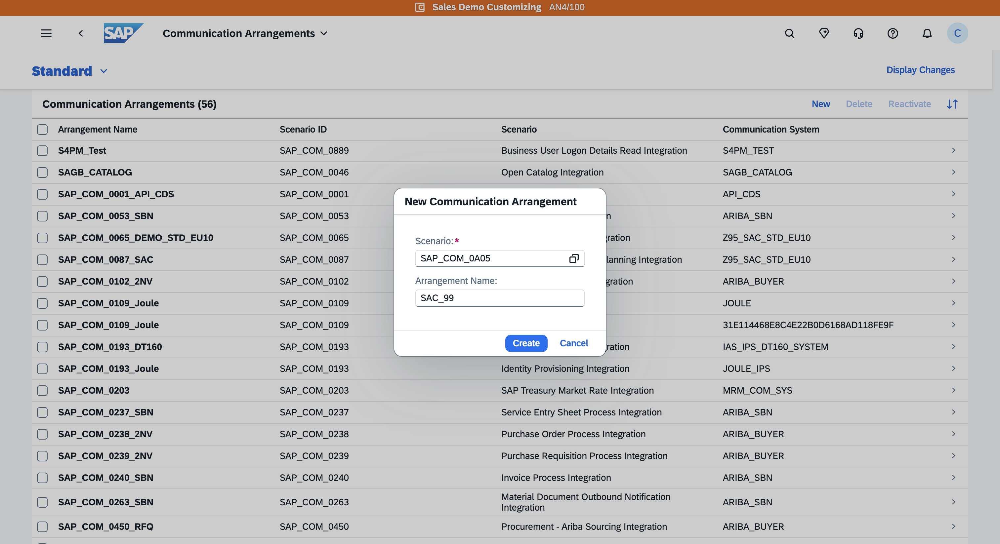
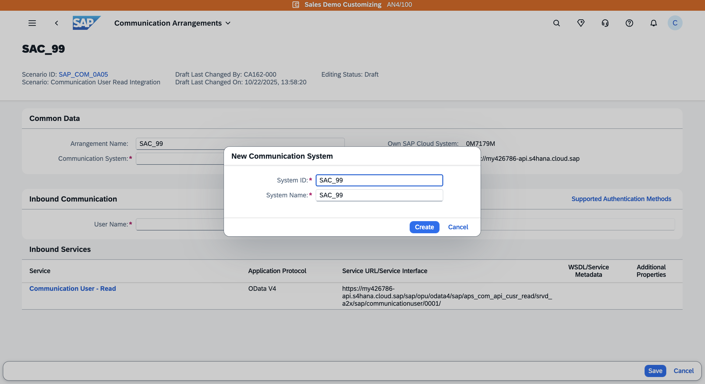
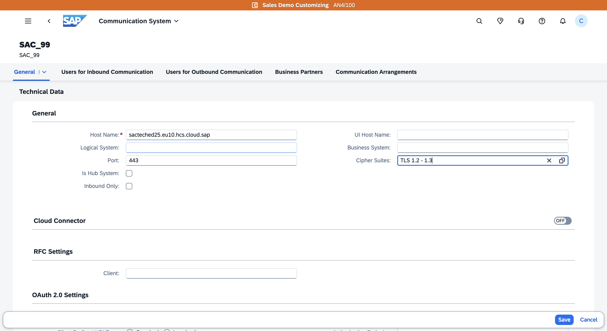
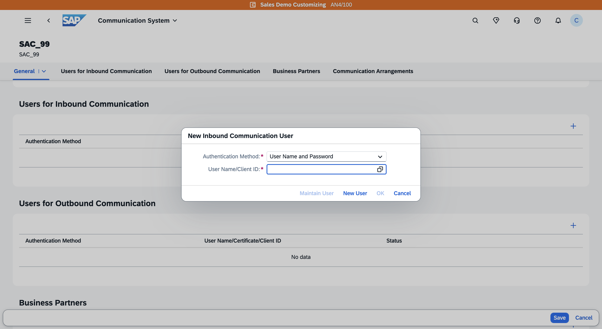
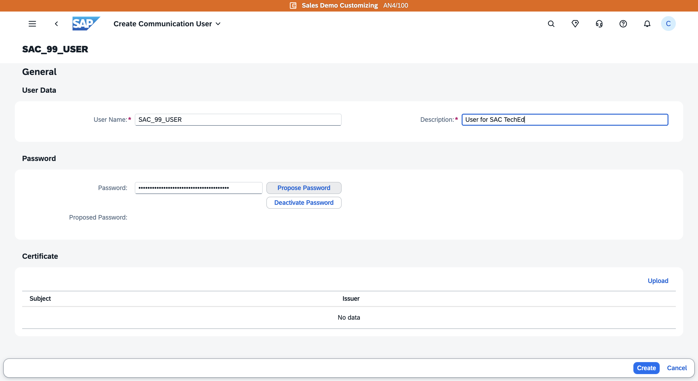
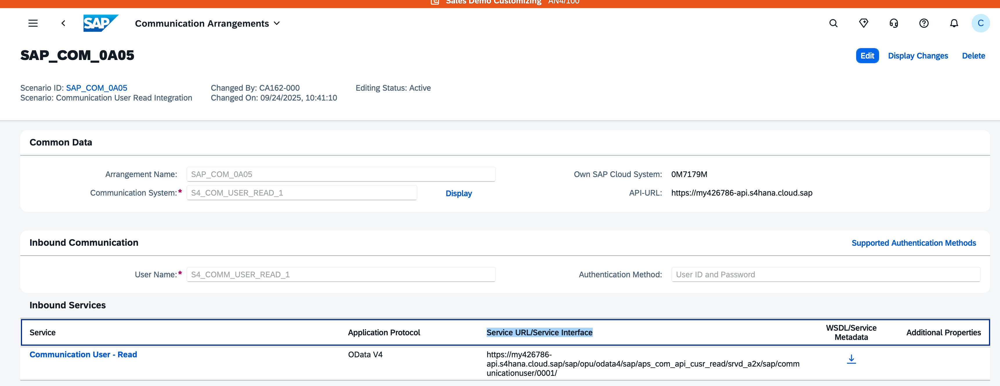
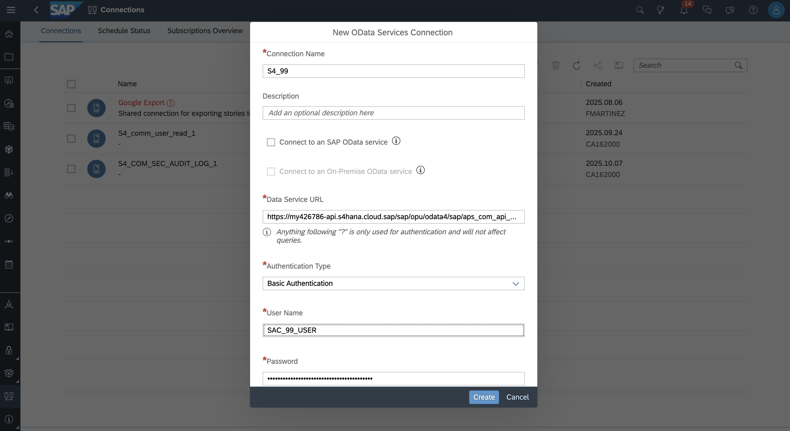

# Exercise 1: Setting Up the Connection Between S/4HANA Cloud Public Edition and SAP Analytics Cloud (SAC)

We’re setting up a connection between **S/4HANA**, the necessary **API**, and **SAP Analytics Cloud (SAC)**, where the data will ultimately be visualized. There are several approaches to this, but essentially, you create a **Communication Arrangement**.

A Communication Arrangement consists of:
- A **Communication System**
- A **Communication User**
- And a **Communication Scenario** (predefined by SAP)

Although it’s possible to configure each component separately, we find it much easier to create a **Communication Arrangement**, because it allows you to create the Communication System and Communication User directly within the same process. You can find the corresponding app on the S/4HANA home page.

As we have noted during preparation, the scenario we're using for today's workshop is `Communication User - Read`, technical name: `SAP_COM_0A05`.

## Step 1.1: Create a Communication Arrangement

Inside the Communication Arrangement Screen, select "New" to create a new arrangement. 

As an example, we’ll use the scenario `SAP_COM_0A05`.  
We search for it by typing `0A05`, the full identifier is `SAP_COM_0A05` (Communication Scenario: "COMMUNICATION USER READ").

Once selected, enter SAC_XY as Arrangement Name, where XY is your seat number.

Click on **Create** – this opens a new screen.

## Step 1.2: Add a New Communication System

We now create a new Communication System – we’ll call it:

SAC_**XY**, where XY is your seat number.

In the next screen, we need to enter the **Hostname** of the SAC system (sacteched25.eu10.hcs.cloud.sap).  
We extract just the hostname (not the full URL) from the SAC URL and enter it here.

Also, for security purposes, we enable TLS (1.2 or 1.3), then **Save**.

## Step 1.3: Create a Communication User

Now, we create a new Communication User.  

In this demo system, we use **Username and Password** authentication. This is not ideal for production systems – for security, certificates would be recommended.

We create a new user with the User Name SAC_XY_USER, where XY is your seat number.

We let the system suggest a secure password.  
Important: we **save the password**, because we’ll need it again later. For example, copy the password into a text file.

We don’t need to fill in other fields. If we were to use them, certificates can be uploaded here, but we skip this and click **Create**.

After this, we are lead back to the previous screen, the user we just created is now pre-filled. We confirm with OK, which assigns this user as the one for the Communication System (Inbound Communication User).

## Step 1.4: Save the Communication Arrangement

Check if all information you need is entered into the respective fields. Then save the Communication Arrangement. The Communication Arrangement is now active and provides a way to connect other systems to our SAP S/4HANA Cloud Public Edition System with the credentials and for the hostname in the newly created communication arrangement. 

Once saved, note the Service URL/Service Interface in "inbound services" - you will need it in the next step. 

## Step 1.5: Add Connection in SAC
In the SAC tenant, select "Connections" in the side navigation (second-to-last icon at the bottom left), then click "Add Connection" (plus icon).

In the dialog, enter the following information (replace XY with your seat number):
- Connection Name: S4_XY
- Data Service URL: the Service URL/Service Interface you have noted in the previous step. 
- User Name: SAC_XY_USER
- Password: The password that was saved when the communication arrangement was created

