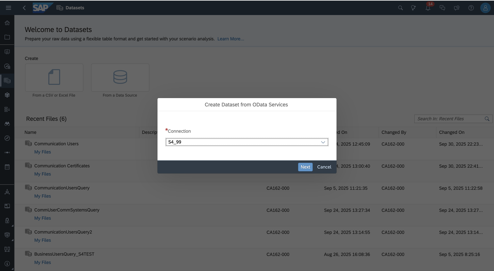
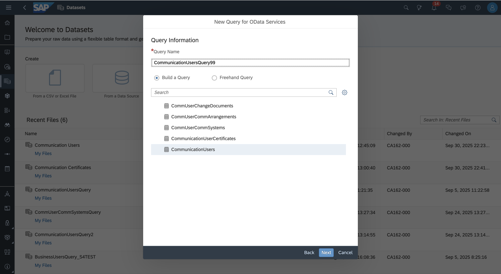
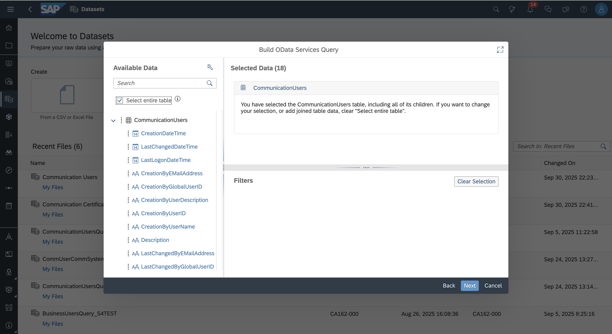
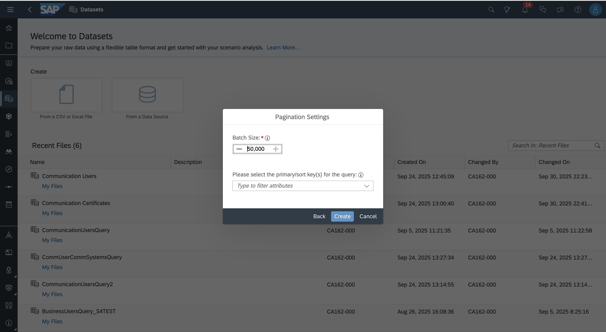
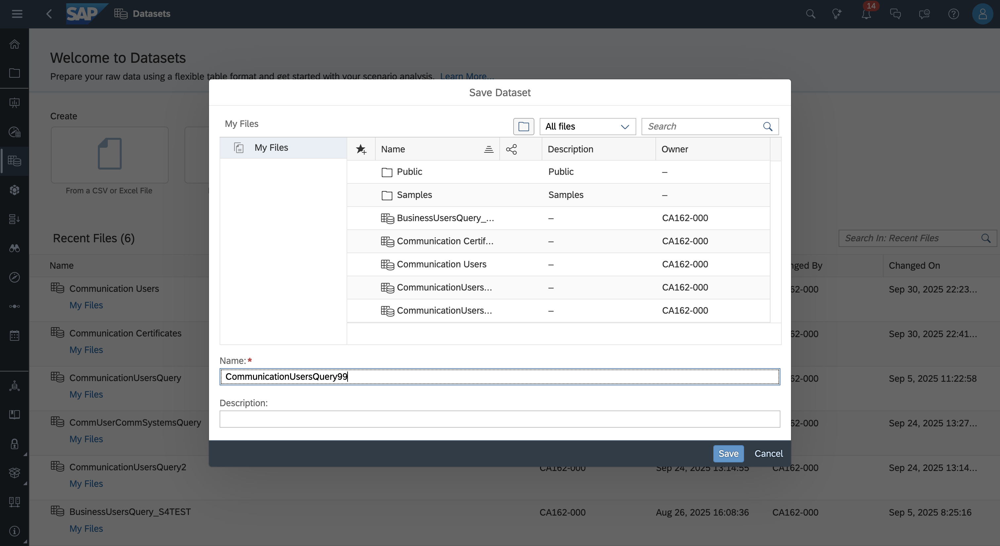

# Exercise 2: Importing data into a dataset and visualizing it in an SAC story

## Step 2.1: Setup data source

1. From the Datasets start page, click "From a Data Source" and select "OData Services". Select the exisitng Connection S4_XY in the dropdown, where XY is your seat number. Click **Next**.

2. Choose CommunicationUsersQuery**XY** as the Query Name (replace XY with your seat number) and select the CommunicationUsers table. Click **Next**.

3. On the Available Data screen choose the option "Select entire table". Click **Next**.

4. Do not change the Batch Size and click **Create**.

5. Click on **Save** to save the Dataset with name CommunicationUsersQuery**XY**.

