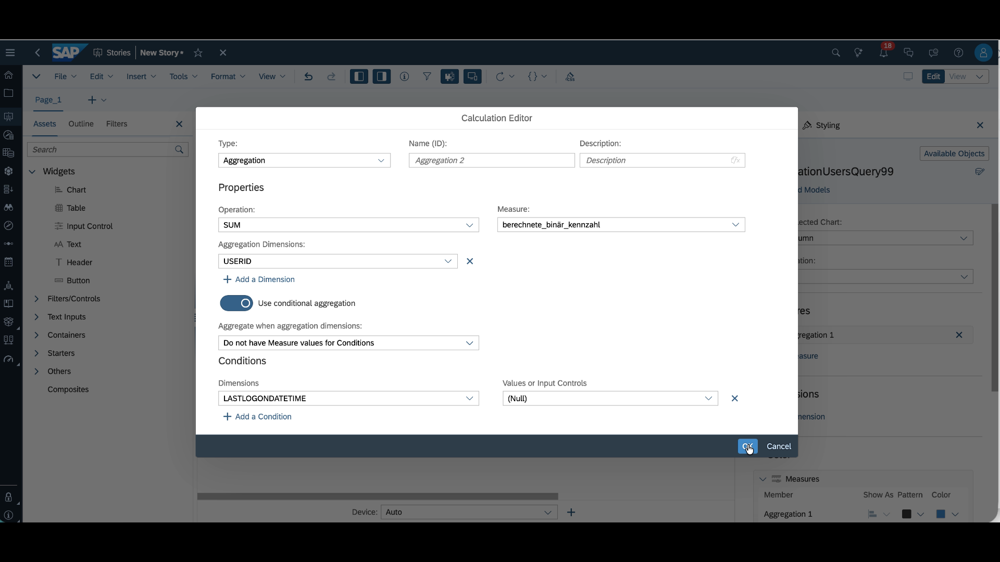

# Exercise 3: Visualizing unused communication scenarios (users) in SAC

Now that we have saved the data from the "Communication User Read" API from the SAP S/4HANA Cloud Public Edition, we want to compare how many users have **never logged in** versus those who **have logged in** at least once.  
Please Note: The actual question is: _Which communication scenarios have never been used?_ but for the purpose of this exercise, we will simplify the analysis, and assume a **1:1 relationship**:  
Each **communication user** belongs to exactly **one communication scenario**.  
Therefore, any communication user who has **never logged in** represents a **communication scenario that has never been used**.

---

## Step 1: Create a Responsive Story

To make the story mobile-friendly, we create a **responsive story**.

We insert a **chart component**, drag it into the canvas, and select our pre-defined data source:  
**Query: Communications Query 99** (Replace **99** with your seatnumber)

## Step 2: Define the Comparison Using a Bar Chart

We want to compare two user groups using a **bar chart**:

- Users who **have logged in**
- Users who **have never logged in**

To prepare the data, we first need to create a helper measure.

---

### Step 1: Define a Binary Measure

Since we are counting (1 or 0), we need a small helper measure—a calculated binary metric. We simply define a value of `1` as the binary metric.

- Open the available objects (in the "builder" window at the right, top right corner) and select calculations. A new window will open.

- Create a calculated Measure and simply enter the value `1` in the 'Edit Formular' Editor.
- Give the helper calculation a name and confirm with OK.
  

### Step 2: Create the Bar Chart

We now create two bars, with a measure for each bar. To this create a new measure:

#### Bar 1: Users Who Have Never Logged In

- For this first bar, we need a calculation again.
- We compute an **aggregation**: the **sum** of all **user IDs** for which the following condition holds:
  - The user has a value indicating they have never logged in.
  - This means the `last log on date` has a value of `null`.
- The binary metric is automatically applied.
- This gives us the first bar: users who have never logged in.

  

#### Bar 2: Users Who Have Logged In

- This is also a calculation.
- Again, we compute an aggregation: the sum of all user IDs.
- This time, the condition is the opposite:
  - The user does **not** have measure values for the condition.
  - The condition remains the same: `last log on date = 0`.
- This gives us the second bar: users who **have** logged in.

- 

### Step 3: Label the Metrics

We should label the metrics appropriately:

- Aggregation 1: `Users without log on date`
- Aggregation 2: `Users with log on date`

## Finalization

- Save the analysis under the name `UnusedUsers99`. (Replace 99 with your seat number)

- Save and finish.
